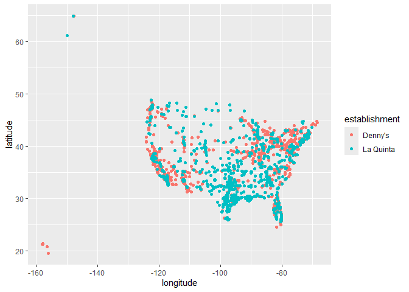
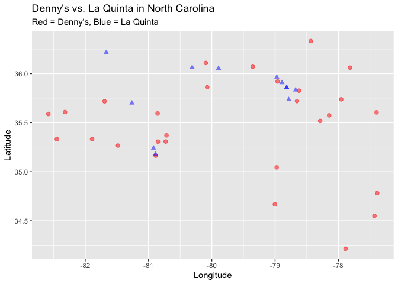
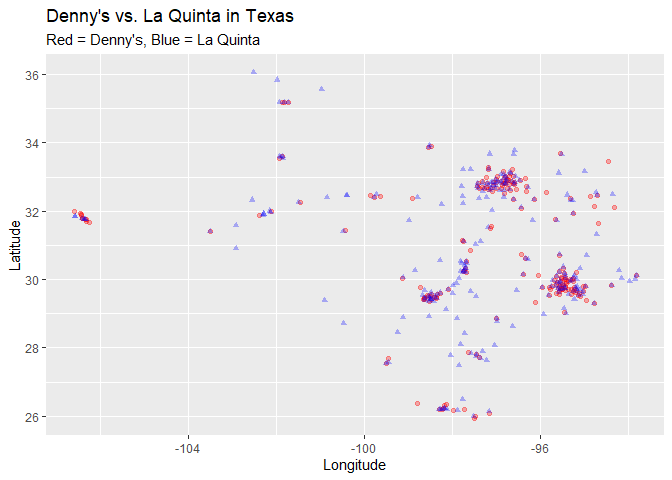

Lab 04 - Visualizing Spatial Data
================
Shatavia Bellmon
2/17/26

### Load packages and data

``` r
#install.packages("devtools")
#devtools::install_github("tidyverse/dsbox")
```

``` r
library(tidyverse)
library(dsbox) 
```

``` r
states <- read_csv("data/states.csv")
```

### Exercise 1

??dennys

??laquinta

View(laquinta)

The Denny’s dataset has 1643 rows and 6 columns. Each row represents an
individual Denny’s location. The variables are address, city, state,
zip, longitude, and latitude.

### Exercise 2

The La Quinta dataset has 909 rows and 6 columns. Each row represents
the different locations of the La Quinta hotels. The variables are
address, city, state, zip, longitude, and latitude.

### Exercise 3

There are La Quintas in Ecuador, Columbia, Dubai, Turkiye, Georgia,
Australia, China, Mexico, and Canada. According to the website given,
there are no Denny’s outside the U.S.

### Exercise 4

One way to deteermine international locations would be to look at the
state abbreviations of each location and see if it belongs to a U.S.
state or not.

### Exercise 5

``` r
dennys %>% 
  filter(!(state %in% states$abbreviation))
```

    ## # A tibble: 0 × 6
    ## # ℹ 6 variables: address <chr>, city <chr>, state <chr>, zip <chr>,
    ## #   longitude <dbl>, latitude <dbl>

### Exercise 6

There are no dennys locations outide the U.S.

``` r
dennys %>%
  mutate(country = "United States")
```

    ## # A tibble: 1,643 × 7
    ##    address                        city    state zip   longitude latitude country
    ##    <chr>                          <chr>   <chr> <chr>     <dbl>    <dbl> <chr>  
    ##  1 2900 Denali                    Anchor… AK    99503    -150.      61.2 United…
    ##  2 3850 Debarr Road               Anchor… AK    99508    -150.      61.2 United…
    ##  3 1929 Airport Way               Fairba… AK    99701    -148.      64.8 United…
    ##  4 230 Connector Dr               Auburn  AL    36849     -85.5     32.6 United…
    ##  5 224 Daniel Payne Drive N       Birmin… AL    35207     -86.8     33.6 United…
    ##  6 900 16th St S, Commons on Gree Birmin… AL    35294     -86.8     33.5 United…
    ##  7 5931 Alabama Highway, #157     Cullman AL    35056     -86.9     34.2 United…
    ##  8 2190 Ross Clark Circle         Dothan  AL    36301     -85.4     31.2 United…
    ##  9 900 Tyson Rd                   Hope H… AL    36043     -86.4     32.2 United…
    ## 10 4874 University Drive          Huntsv… AL    35816     -86.7     34.7 United…
    ## # ℹ 1,633 more rows

### Excercise 7

There are La Quintas in Ecuador, Columbia, Dubai, Turkiye, Georgia,
Australia, China, Mexico, and Canada.

### Excercise 8

``` r
lq <- laquinta
```

View(lq)

``` r
lq <- lq %>%
  mutate(country = case_when(
    state %in% state.abb ~ "United States",
    state %in% c("ON", "BC") ~ "Canada",
    state == "ANT" ~ "Colombia",
    state == "FM" ~ "Honduras",
    state %in% c("AG", "CH", "NL", "PU", "QR", "SL", "VE") ~ "Mexico"
  ))
summary(factor(lq$country))
```

    ##        Canada      Colombia      Honduras        Mexico United States 
    ##             2             1             1            10           895

### Excercise 9

``` r
lq <- lq %>%
  filter(country == "United States")
```

California has the most amount of dennys. Alaska, Montana, South Dakota,
and Vermont had the fewest amounts of Dennys. This makes sense as
California is the biggest state in the U.S., so more land equals more
oppurtunity to build a dennys. The other states with only 1 dennys have
many rural areas so it there is not a lot of business that can come from
these states.

Least: Mexico and Columbia Most: California, Florida, Texas This makes
sense as California, Florida, and Texas are the states in the U.S. with
the biggest populations, so more people equals more opportunity to have
business. Mexico and Columbia probably have more culturally significant
restaurants prevalent in their countries.

``` r
dn <- dennys
```

``` r
dn %>% 
  count(state) %>% 
  inner_join(states, by = c("state" = "abbreviation"))
```

    ## # A tibble: 51 × 4
    ##    state     n name                     area
    ##    <chr> <int> <chr>                   <dbl>
    ##  1 AK        3 Alaska               665384. 
    ##  2 AL        7 Alabama               52420. 
    ##  3 AR        9 Arkansas              53179. 
    ##  4 AZ       83 Arizona              113990. 
    ##  5 CA      403 California           163695. 
    ##  6 CO       29 Colorado             104094. 
    ##  7 CT       12 Connecticut            5543. 
    ##  8 DC        2 District of Columbia     68.3
    ##  9 DE        1 Delaware               2489. 
    ## 10 FL      140 Florida               65758. 
    ## # ℹ 41 more rows

### Excercise 10

``` r
dn <- dn %>%
  mutate(establishment = "Denny's")
lq <- lq %>%
  mutate(establishment = "La Quinta")
```

``` r
dn_lq <- bind_rows(dn, lq)
```

``` r
ggplot(dn_lq, mapping = aes(
  x = longitude,
  y = latitude,
  color = establishment
)) +
  geom_point()
```

<!-- -->

### Excercise 11

``` r
dn_nc <- dn %>% filter(state == "NC")
lq_nc <- lq %>% filter(state == "NC")
```

``` r
ggplot() +
  geom_point(data = dn_nc, aes(x = longitude, y = latitude), 
             color = "red", alpha = 0.5, size = 2) +
  geom_point(data = lq_nc, aes(x = longitude, y = latitude), 
             color = "blue", alpha = 0.5, size = 2, shape = 17) +
  labs(title = "Denny's vs. La Quinta in North Carolina",
       subtitle = "Red = Denny's, Blue = La Quinta",
       x = "Longitude", y = "Latitude")
```

<!-- --> Mitch
Hedberg’s joke does not appear to hold here, there are only a few places
where there is a laquinta next to a Denny’s

### Excercise 12

``` r
dn_tx <- dn %>% filter(state == "TX")
lq_tx <- lq %>% filter(state == "TX")
```

``` r
ggplot() +
  geom_point(data = dn_tx, aes(x = longitude, y = latitude), 
             color = "red", alpha = 0.3, size = 1.5) +
  geom_point(data = lq_tx, aes(x = longitude, y = latitude), 
             color = "blue", alpha = 0.3, size = 1.5, shape = 17) +
  labs(title = "Denny's vs. La Quinta in Texas",
       subtitle = "Red = Denny's, Blue = La Quinta",
       x = "Longitude", y = "Latitude")
```

<!-- --> Mitch
Hedberg’s joke DEFENITELY appears to hold here!
